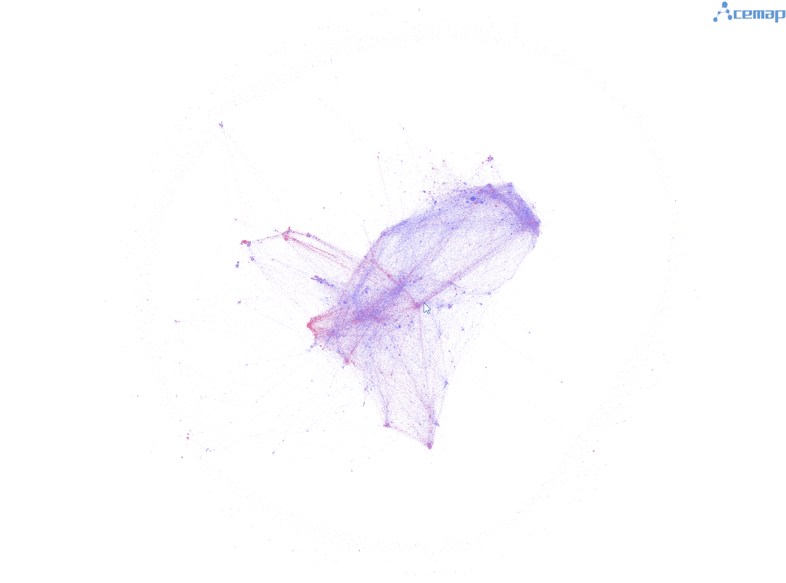
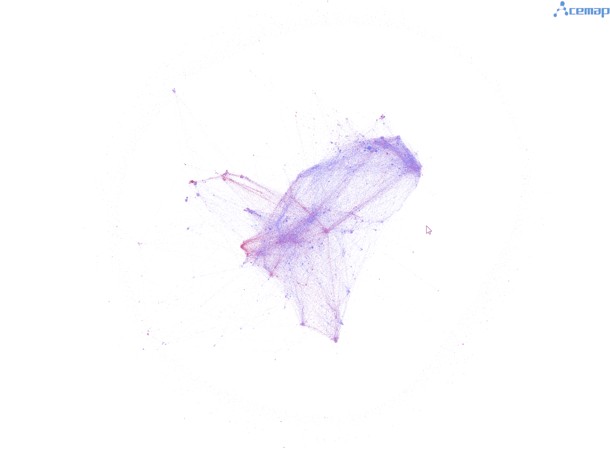
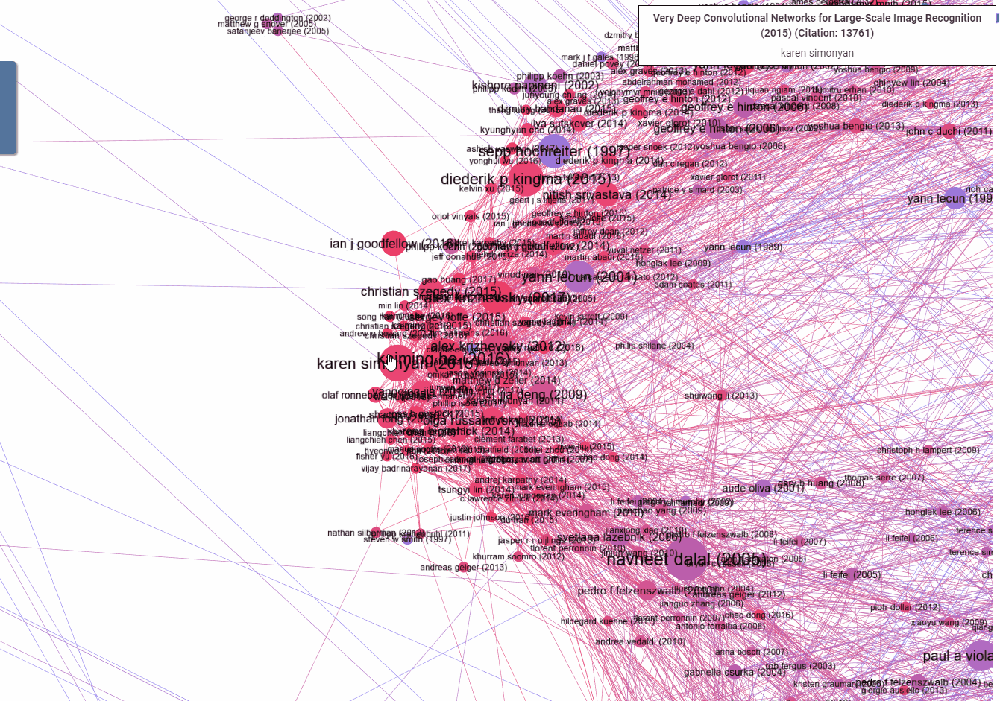
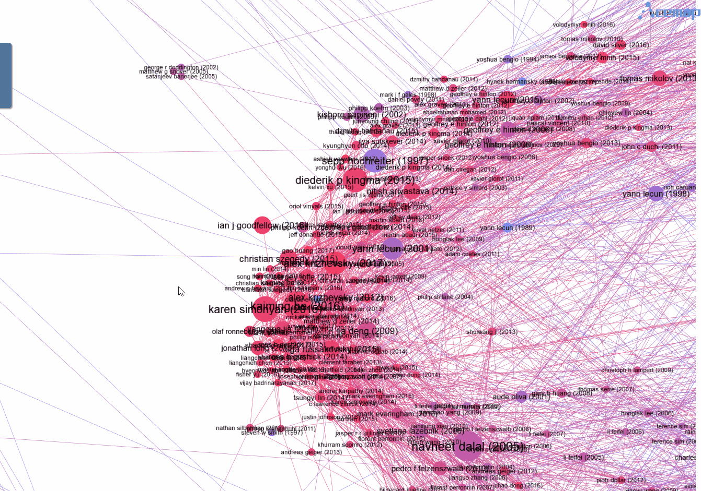
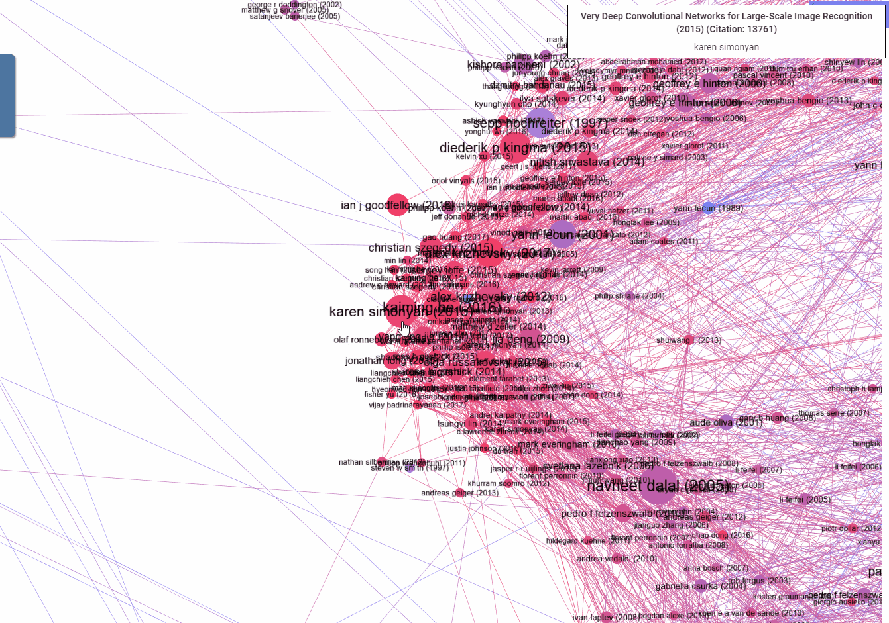
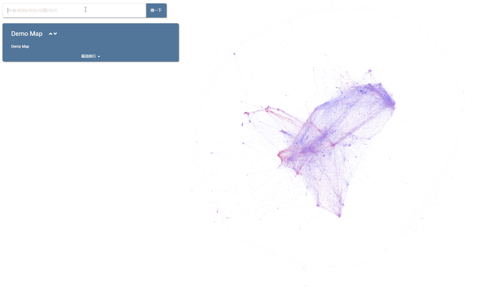

# Pixi network visualization
 This is a demonstration for large-scale network visualization with [Pixi.js](https://github.com/pixijs/pixi.js).

### About Pixi.js
Pixi.js is a JavaScript library for HTML5 2D animation rendering. Pixi.js has full support for WebGL, which leverages GPU to accelerate the rendering process. Also, Pixi.js provides useful interfaces for creating **rich** and **interactive** graphics. Please refer to [Pixi git](https://github.com/pixijs/pixi.js) and [official website](https://www.pixijs.com/) for more information.

### About this demo
This demonstration is about using Pixi.js to create large-scale interactive network visualization. Although js libraries like [Sigma.js](https://github.com/jacomyal/sigma.js) and [ECharts](https://github.com/apache/incubator-echarts) can achieve similar effects, I choose Pixi.js because of its flexibility and full-support for WebGL acceleration. I started this project as a part of [Acemap](https://www.acemap.info/), an academic map system developed by [IIOT@SJTU](http://iiot.sjtu.edu.cn/index_ch.html). Data used in this demo (data/cs_top.json) is from Acemap database, which is a citation network of all top papers (citation 1000+) in the field of Computer Science. In this network, there are **15,745 nodes** and **69,839 edges** in total. Layout is obtained by applying ForceAtlas2 algorithm in [Gephi](https://github.com/gephi/gephi).

### Features
Except for WebGL-based nodes and edges rendering, many useful features are implemented to create interactive visualization:

- Zoom in / Zoom out

- Dragging

- Click to highlight neighbors (right click to reset)

- Mouseover / Mouseout (show tooltip)

- Double click event

- Search (try it by using `search(str)` in demo.html)

  
### TODO
- Optimize time performance of neighbors highlighting
- Gephi-like curved edges
- Lower memory cost